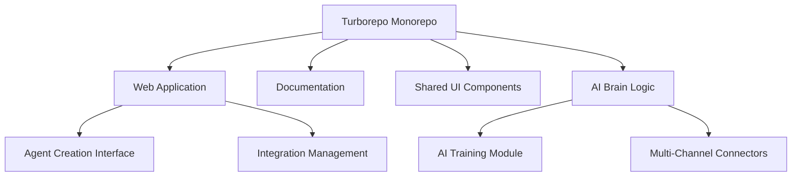

# Plura 🧠🤖


## 🚀 Introduction

Plura is a revolutionary SaaS platform that redefines AI-powered communication and interaction. Our innovative solution allows you to create intelligent "brains" - custom AI agents that can be trained with specific information and connected across multiple communication channels.

## 🌈 Powered by Turborepo

### Why Turborepo?

Plura leverages Turborepo to create a cutting-edge, highly efficient monorepo architecture that provides:

- **Unprecedented Build Speed**: Turborepo's intelligent caching reduces build and development times
- **Consistent Tooling**: Unified configurations across all project packages
- **Scalable Architecture**: Easy management of multiple applications and shared components
- **Remote Caching**: Efficient build artifact sharing across development and CI/CD environments

### Monorepo Structure

Our project is organized into multiple packages and applications:

- `apps/web`: Main Plura web application
- `apps/docs`: Documentation site
- `packages/ui`: Shared React component library
- `packages/eslint-config`: Standardized linting configurations
- `packages/typescript-config`: Centralized TypeScript configurations
- `packages/ai-brain`: Core AI brain logic and utilities
- `packages/integrations`: Communication channel connectors

## 🌟 Core Vision

Plura empowers businesses and individuals to create intelligent, context-aware AI agents that can seamlessly interact across various platforms, breaking down communication barriers and providing personalized, intelligent responses.

## 🔑 Key Features

### 🧠 Intelligent AI Brain Creation
- **Custom AI Training**: Easily teach your AI agents with specific, tailored information
- **Multi-Channel Connectivity**: Connect agents to websites, WhatsApp, Discord, Instagram, and more
- **Contextual Learning**: Continuously improve agent intelligence based on interactions
- **Flexible Integration**: Seamless connection between brains and communication channels

### 🤖 Agent Capabilities
- **Adaptive Communication**: Agents that understand and respond with context
- **Cross-Platform Deployment**: Deploy a single brain across multiple communication platforms
- **Customizable Personality**: Define unique traits and communication styles for each agent
- **Real-time Information Processing**: Instantaneous response generation

## 🏗 System Architecture



## 💻 Tech Stack

### Frontend
- Next.js 14
- React 18
- TypeScript
- Turborepo
- Tailwind CSS
- Shadcn UI
- Zustand (State Management)

### Backend
- Node.js
- NestJS
- GraphQL
- PostgreSQL
- Redis
- Prisma ORM

### DevOps & Infrastructure
- Vercel
- GitHub Actions
- Turborepo Remote Caching

## 🚀 Getting Started

### Prerequisites
- Node.js (v19+)
- PNPM
- Docker (optional)

### Installation & Setup

1. Clone the repository
```bash
git clone https://github.com/your-org/plura.git
cd plura
```

2. Install dependencies
```bash
pnpm install
```

3. Run the entire monorepo
```bash
# Run all applications in development mode
pnpm dev

# Build all applications
pnpm build

# Run specific application
pnpm dev --filter web
```

## 🔐 Turborepo Configuration

Our `turbo.json` enables powerful monorepo capabilities:
- Efficient task running
- Intelligent caching
- Parallel execution
- Remote caching support

### Example Turbo Task
```json
{
  "$schema": "https://turbo.build/schema.json",
  "pipeline": {
    "build": {
      "outputs": ["dist/**", ".next/**"],
      "dependsOn": ["^build"]
    },
    "lint": {},
    "dev": {
      "cache": false
    }
  }
}
```

## 📦 Deployment

### Vercel Deployment
[](https://vercel.com/new/clone?repository-url=https%3A%2F%2Fgithub.com%2Fyour-org%2Fplura)

## 🤝 Contributing

We welcome contributions to our Turborepo-powered platform!

### Contribution Guidelines
1. Understand our monorepo structure
2. Use PNPM workspaces
3. Leverage Turborepo for efficient development
4. Maintain shared configurations
5. Write comprehensive tests

## 📊 Roadmap

- [x] Turborepo Monorepo Setup
- [x] Core Platform MVP
- [ ] Enhanced AI Training Modules
- [ ] Expanded Communication Channel Integrations
- [ ] Advanced Analytics for Agent Performance

## 📄 Licensing

Distributed under the MIT License.

## 📞 Contact

- Project Link: [GitHub Repository](https://github.com/Skidgod4444/plura)
- Discord: [Discord](https://discord.gg/plura)
---

**Engineered with 🚀 Turborepo & ❤️ by the Plura Team**